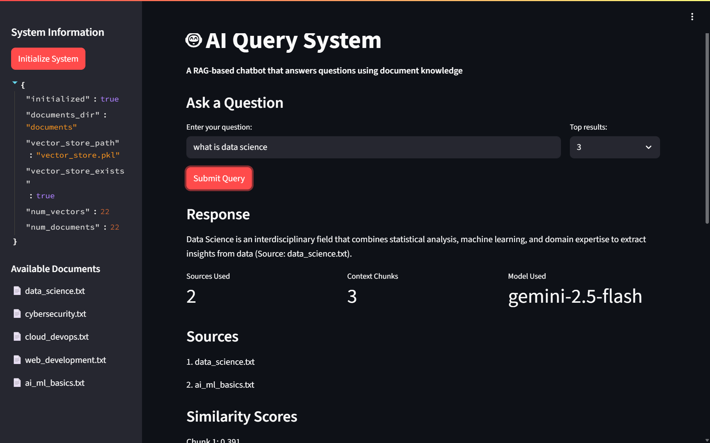

# AI Query System
A complete RAG-based (Retrieval-Augmented Generation) chatbot system that accepts user queries, retrieves relevant content from documents, and provides responses with source citations.

## 🚀 Features
- **Document Ingestion**: Processes multiple text documents and creates searchable chunks
- **Vector Search**: Uses TF-IDF embeddings with cosine similarity for content retrieval
- **LLM Integration**: Uses Google Gemini API for intelligent responses
- **Multiple Interfaces**: Command-line, REST API, and web frontend options
- **Source Attribution**: Provides citations and references for all responses
- **Feedback Collection**: Allows users to rate and comment on responses

## 🏗️ Architecture
```
├── documents/           # Sample documents 
├── src/                # Core system modules
│   ├── document_processor.py    # Document loading and chunking
│   ├── embeddings.py           # TF-IDF embeddings and vector store
│   ├── llm_interface.py        # Gemini LLM interface
│   └── ai_query_system.py      # Main system coordinator
├── api_server.py       # REST API server (FastAPI/HTTP fallback)
├── streamlit_app.py    # Streamlit web interface
└── static/index.html   # Simple HTML frontend
```
### Demo 


## 📦 Installation
### Prerequisites
- Python 3.12 or higher
- Google Gemini API key

### Quick Setup
1. **Clone the repository**:
   ```bash
   git clone https://github.com/ankitT20/AIQuerySystem.git
   cd AIQuerySystem
   ```

2. **Install dependencies**:
   ```bash
   apt install python3.12-venv
   sudo apt install swig
   sudo apt install build-essential libomp-dev
   python3 -m venv venv
   source venv/bin/activate
   pip install -r requirements.txt
   ```

3. **Set environment variable**:
   ```bash
   export GEMINI_API_KEY=your_gemini_api_key_here
   ```
   
4. **Run streamlit**:
   ```bash
   streamlit run streamlit_app.py
   ```

## 🚀 Quick Start
### Command Line Interface
```bash
# Interactive mode
python3 src/ai_query_system.py

# Single query
python3 src/ai_query_system.py "What is machine learning?"
```

### REST API Server
```bash
# Start the API server
python3 api_server.py

# Test with curl
curl -X POST http://localhost:8000/query \
  -H "Content-Type: application/json" \
  -d '{"question": "What is artificial intelligence?"}'
```

### Web Interface (if Streamlit is installed)
```bash
streamlit run streamlit_app.py
```

### Simple Web Interface
1. Start the API server: `python3 api_server.py`
2. Open `http://localhost:8000` in your browser
3. Use the HTML interface to ask questions

## 📝 Sample Queries
Try these example questions:

- "What is artificial intelligence?"
- "How does machine learning work?"
- "What are the components of data science?"
- "Explain cloud computing services"
- "What are cybersecurity best practices?"

## 🔧 Technical Stack
### Core Technologies
- **Language**: Python 3.12+
- **Vector Database**: Custom TF-IDF implementation with cosine similarity
- **LLM**: Google Gemini (gemini-2.5-flash)
- **Document Processing**: Custom text chunking with sentence boundary detection

### Web Frameworks 
- **API**: FastAPI (with HTTP server fallback)
- **Frontend**: Streamlit + HTML/CSS/JavaScript
- **Server**: Uvicorn (with basic HTTP fallback)

### Libraries Used
- `google-genai` - Google Gemini API client
- `requests` - HTTP client for API calls
- `json` - Data serialization
- `pickle` - Vector store persistence
- `re` - Text processing and tokenization
- `math` - Mathematical operations for similarity

## 🎯 System Workflow
1. **Document Processing**:
   - Load text files from `documents/` directory
   - Split into overlapping chunks (500 chars with 50 char overlap)
   - Preserve sentence boundaries where possible

2. **Embedding Generation**:
   - Create TF-IDF vectors for all document chunks
   - Build vocabulary and compute IDF scores
   - Store vectors with metadata for retrieval

3. **Query Processing**:
   - Convert user query to TF-IDF vector
   - Compute cosine similarity with all document chunks
   - Retrieve top-k most relevant chunks

4. **Response Generation**:
   - Send query + context to Gemini LLM
   - Generate response with source attribution
   - Return structured response with metadata

## 🔌 API Endpoints
### POST `/query`
Submit a question and get an AI-generated response.

**Request**:
```json
{
  "question": "What is machine learning?",
  "top_k": 3
}
```

**Response**:
```json
{
  "success": true,
  "data": {
    "query": "What is machine learning?",
    "response": "Machine Learning (ML) is a subset of AI...",
    "sources": ["ai_ml_basics.txt"],
    "model_used": "gemini-2.5-flash",
    "context_chunks": 3,
    "timestamp": "2024-01-01T12:00:00.000000",
    "similarity_scores": [0.85, 0.72, 0.68]
  }
}
```

### GET `/system/info`
Get system status and configuration.

### GET `/system/documents`
List available documents in the knowledge base.

### POST `/feedback`
Submit feedback for query responses.

## 🔮 Future Enhancements
### Immediate Improvements
- [ ] **Advanced Embeddings**: Integrate SentenceTransformers or Gemini embeddings
- [ ] **Vector Database**: Add FAISS or Chroma for better scalability
- [ ] **File Support**: PDF, DOCX, and other document formats
- [ ] **Semantic Search**: Improve relevance with transformer-based embeddings

### Advanced Features
- [ ] **Role-based Filtering**: Filter responses based on user roles
- [ ] **Conversation Memory**: Multi-turn conversation support
- [ ] **Document Upload**: Dynamic document addition via web interface
- [ ] **Analytics Dashboard**: Query analytics and feedback insights

### Production Ready
- [ ] **Database Integration**: PostgreSQL/MongoDB for vector storage
- [ ] **Authentication**: User management and API keys
- [ ] **Caching**: Redis for response caching
- [ ] **Monitoring**: Logging, metrics, and health checks

## Thank You !👏
<!-- deactivate -->
